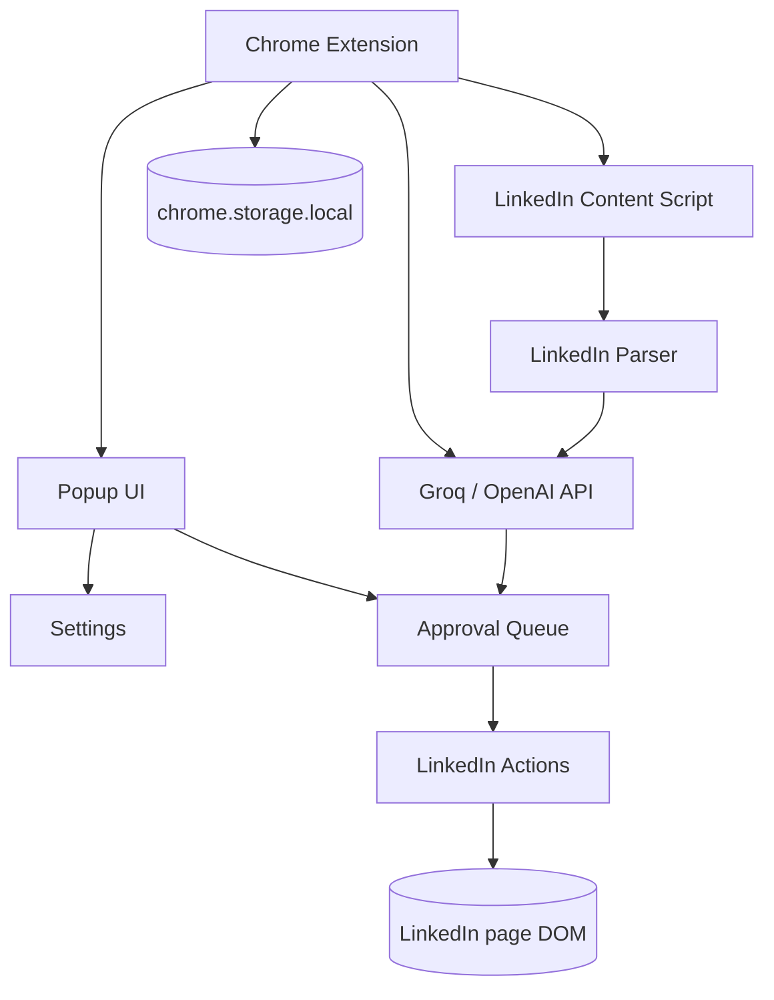

# Engagr Extension Guide

This guide describes the planned local-first Chrome Extension workflow for the personal MVP. The extension itself is not implemented yet; this file is the build and launch checklist for the next iterations.

## MVP scope

The first working MVP should include only:

1. Chrome Extension scaffold.
2. LinkedIn parser.
3. AI comment generation.
4. Mini App / extension control UI.
5. Approval queue.
6. LinkedIn actions.

Reddit, user memory, ideas engine, and X/Twitter come after the LinkedIn MVP is usable.

## Target local architecture



## Planned extension folder

```text
extension/
├── manifest.json
├── src/
│   ├── background.js
│   ├── popup/
│   │   ├── index.html
│   │   ├── popup.css
│   │   └── popup.js
│   ├── content/
│   │   └── linkedin.js
│   └── shared/
│       ├── aiClient.js
│       ├── queueStore.js
│       └── storage.js
└── assets/
    └── icon.png
```

## Local installation flow

After the extension is implemented:

1. Open Chrome.
2. Go to `chrome://extensions`.
3. Enable **Developer mode**.
4. Click **Load unpacked**.
5. Select the `extension/` folder.
6. Pin the Engagr extension to the toolbar.
7. Open the popup and verify the status is **Connected** / **Ready**.

## Local settings checklist

Store these values in `chrome.storage.local` from the popup settings screen:

```json
{
  "ai_provider": "groq",
  "api_key": "your_api_key_here",
  "tone": "technical",
  "project": "Yosya",
  "audience": "developers",
  "goal": "growth"
}
```

## Daily LinkedIn workflow

1. Open LinkedIn in Chrome.
2. Open the Engagr extension popup.
3. Click **Scan LinkedIn**.
4. Review parsed posts in Queue.
5. Click **Generate** or **Regenerate** for AI comments.
6. Click **Approve** on the best draft.
7. Extension opens/focuses the LinkedIn post.
8. Extension inserts the approved comment draft.
9. You manually review and press the final LinkedIn submit button.

## Design direction

The first popup should follow a clean card-based style similar to the reference image:

- white card on light background;
- small app icon on the left;
- app title, for example **Engagr WebBridge**;
- green rounded **Connected** pill;
- large center status icon;
- short status text such as **Browser assistant is ready**;
- compact actions: **Scan**, **Queue**, **Settings**.

## Chrome Web Store release checklist

When the local MVP is stable:

1. Prepare production icons: 16, 32, 48, 128 px.
2. Remove debug logs and test API keys.
3. Add a clear privacy policy.
4. Explain host permissions for LinkedIn/Reddit/X.
5. Build a ZIP from the extension folder.
6. Create a Chrome Web Store Developer account.
7. Upload the ZIP.
8. Add screenshots and description.
9. Submit for review.

## Important MVP constraint

The first version should not auto-publish by default. The extension should insert drafts and let the user make the final publish decision inside LinkedIn.
