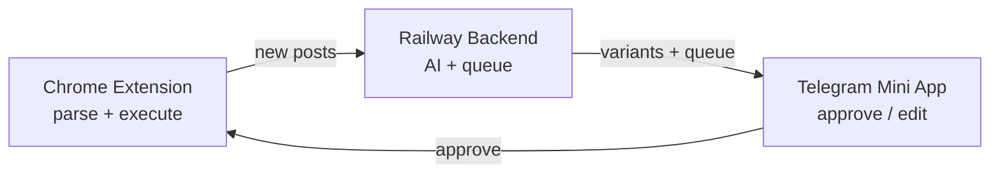
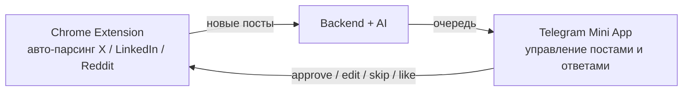

# Engagr

**AI-powered engagement assistant:** Chrome Extension parses LinkedIn, X, and Reddit → Groq generates comment variants → you approve in Telegram Mini App → Extension posts comments, likes, and connections.

👉 **Bot:** [@Engagr_bot](https://t.me/Engagr_bot)

📋 **Development plan:** [PROJECT_PLAN.md](PROJECT_PLAN.md) — source of truth for architecture, phases, and task checklist.

---

## How it works



1. **Extension** scans open tabs every 15 minutes (LinkedIn, X, Reddit) and pushes new posts to the backend.
2. **Backend** (Railway) generates AI comment variants, stores the queue, sends Telegram notifications.
3. **Mini App** shows posts — edit, regenerate, approve, or skip.
4. **Extension** executes approved actions in the browser (comment, like, connect/follow).

**Reddit** is also discoverable via backend scheduler (public JSON) when the browser is closed.

**Human approve is required** before any action — this is intentional for account safety.

---

## Stack

| Component | Tech | Role |
|-----------|------|------|
| Backend | Python 3.11, Flask, APScheduler | API, AI, queue, Telegram bot |
| Frontend | React, Vite | Telegram Mini App |
| Extension | Chrome MV3 | DOM parsing + action execution |
| AI | Groq (llama-3.3-70b) | Comment generation |
| Deploy | Railway (API), Vercel (frontend) | Production |

---

## Quick start

### Requirements

- Python 3.11+
- Node.js 18+
- Telegram bot token ([@BotFather](https://t.me/BotFather))
- Groq API key

### Install

```bash
git clone https://github.com/Leks2000/Engagr.git
cd Engagr

pip install -r requirements.txt

cd frontend && npm install && npm run build && cd ..
```

### Environment

```bash
cp .env.example .env
```

```env
TELEGRAM_BOT_TOKEN=your_bot_token
GROQ_API_KEY=your_groq_key
MINI_APP_URL=https://your-frontend-url.com
```

### Run

```bash
python backend/main.py
```

Frontend dev server:

```bash
cd frontend && npm run dev
```

### Chrome Extension

1. Open `chrome://extensions` → **Developer mode** → **Load unpacked** → select `extension/`
2. In Mini App → **Settings** → generate extension login code (5 min)
3. Paste code in extension popup → **Connect**
4. Keep social tabs open for auto-scan

---

## Project structure

```text
Engagr/
├── PROJECT_PLAN.md      ← development roadmap (read this first)
├── backend/
│   ├── main.py          Flask API + routes
│   ├── scheduler.py     Reddit/LinkedIn scheduled sessions
│   ├── ai_comment.py    Groq comment generation
│   ├── telegram_bot.py  Bot commands + queue cards
│   ├── reddit_public.py Reddit parsing (no OAuth)
│   ├── linkedin.py      LinkedIn API (cookie-based, fallback)
│   └── queue_executor.py Server-side execution (Reddit/LinkedIn legacy)
├── extension/src/
│   ├── background.js    Auto-scan (15 min) + task polling
│   ├── linkedin_parser.js, x_parser.js, reddit_parser.js
│   └── linkedin_actions.js, x_actions.js
├── frontend/src/
│   ├── App.jsx
│   └── screens/         Dashboard, Queue, Settings, …
└── data/                Per-user JSON (gitignored)
```

---

## Mini App (target navigation)

| Tab | Purpose |
|-----|---------|
| **Feed** | All posts + execution status |
| **Queue** | Pending items — approve / edit / skip |
| **Settings** | Platforms, keywords, limits, extension code |
| **Profile** | User Memory for AI personalization |

See [PROJECT_PLAN.md](PROJECT_PLAN.md) for implementation phases.

---

## Daily limits

| Platform | Comments | Likes / Upvotes | Connections |
|----------|----------|-----------------|-------------|
| LinkedIn | 15/day | 5/day | 5/day |
| Reddit | 15/day | 5/day | — |
| X | 15/day | 5/day | Follow via extension |

Warm-up mode and random delays between actions are enabled by default.

---

## Bot commands

| Command | Description |
|---------|-------------|
| `/start` | Welcome + setup |
| `/queue` | Pending comments |
| `/dashboard` | Today's stats |
| `/settings` | Open Mini App |
| `/pause` / `/resume` | Pause/resume automation |

---

<<<<<<< HEAD
## Railway deployment
=======
## Daily Limits (Hard Caps)

| Platform | Action     | Max/Day |
|----------|-----------|---------|
| LinkedIn | Comments   | 15      |
| LinkedIn | Likes      | 5       |
| LinkedIn | Connections| 5       |
| Reddit   | Comments   | 15      |
| Reddit   | Upvotes    | 5       |

---

## Anti-spam Delays

| Action             | Delay Range     |
|--------------------|-----------------|
| Between comments   | 5–30 minutes    |
| Between likes      | 2–7 minutes     |
| Between connections| 3–10 minutes    |

---

## Bot Commands

| Command       | Description                |
|---------------|----------------------------|
| `/start`      | Welcome + setup            |
| `/dashboard`  | Today's stats              |
| `/queue`      | Pending comments           |
| `/settings`   | Open Mini App settings     |
| `/digest`     | Get daily top-3 posts      |
| `/connections`| View networking CRM        |
| `/linkedin`   | LinkedIn setup guide       |
| `/reddit`     | Reddit setup guide         |
| `/pause`      | Pause all sessions         |
| `/resume`     | Resume sessions            |

---

## Key Killer Features

### 1. Humanness Scorer
Posts are analyzed for AI-generated patterns (cliches, emoji spam, engagement bait). Only genuinely human posts appear in your queue.

### 2. Interaction Memory (CRM)
The app remembers who you've engaged with before. When the same author posts again, you get a notification: "You've interacted with them 3 times before. Keep building this relationship!"

### 3. News Jacking
First comments under viral posts get 90% of views. The system monitors RSS feeds and alerts you to trending topics matching your keywords.

### 4. Nested Conversation Booster
When someone replies to your AI comment, the app generates a follow-up reply to keep the conversation going and convert leads.

### 5. Daily Digest
Every morning, you receive 3 top posts with ready-made comments in Telegram. One tap to copy + open.

---
#Work process

---

## Railway Deployment
>>>>>>> ba736018ed3c76cc7a3cc11841a3525ea26d6b77

1. Push to GitHub
2. [railway.app](https://railway.app) → Deploy from GitHub
3. Set env vars (`TELEGRAM_BOT_TOKEN`, `GROQ_API_KEY`, `MINI_APP_URL`)
4. Health check: `/health`

---

## License

MIT
