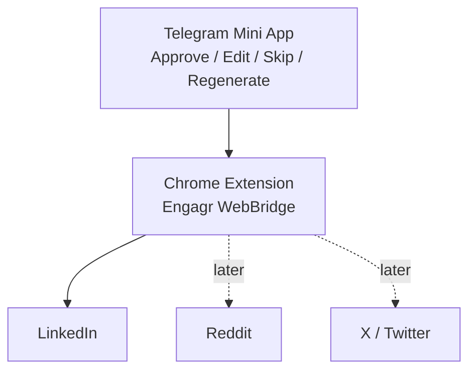
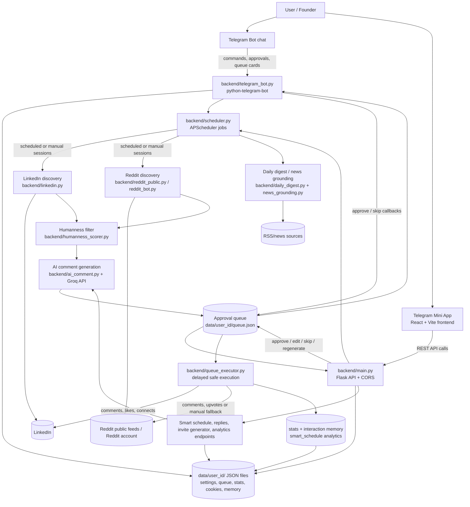

# Engagr

**Engagr is a Telegram Mini App + Telegram Bot that helps founders and growth teams automate LinkedIn and Reddit engagement with AI, safe pacing, and human approval workflows.**

👉 **Use the official bot:** [@Engagr_bot](https://t.me/Engagr_bot)

---

## Repository Description (for GitHub)

Use this as your GitHub repository description:

> AI-powered Telegram Mini App for LinkedIn & Reddit engagement automation with approval queue, warm-up mode, anti-ban limits, and live session logs.

## Suggested GitHub Topics

Add these topics in your repo settings:

- `telegram-bot`
- `telegram-mini-app`
- `linkedin-automation`
- `reddit-bot`
- `ai-comments`
- `playwright`
- `flask`
- `react`
- `growth-automation`
- `social-media-automation`

---

## What Engagr Does

- Generates contextual AI comments for LinkedIn and Reddit.
- Lets you approve, edit, skip, or regenerate comments before posting.
- Runs scheduled engagement sessions with jittered timing and daily limits.
- Supports warm-up mode for safer account ramp-up.
- Shows live session logs so users can see what automation is doing.

---

## Core Features

- 🤖 **AI Comment Generation** with selectable tone/persona.
- 🔗 **LinkedIn Automation** via browser-based workflow and session cookies.
- 🧡 **Reddit Automation** with API-based integration.
- 📱 **Telegram Mini App UI** for onboarding, dashboard, queue, and settings.
- 💬 **Telegram Chat Fallback** for approvals directly in bot chat.
- ⏰ **Smart Scheduling** with per-platform sessions.
- 🛡️ **Anti-ban Controls**: jitter, hard daily caps, and pacing.
- 📊 **Live Session Visibility**: logs + health/status widgets.

---

## Quick Start

### 1) Requirements

- Python 3.11+
- Node.js 18+
- Telegram bot token from [@BotFather](https://t.me/BotFather)

### 2) Install

```bash
git clone https://github.com/Leks2000/Engagr.git
cd Engagr

# Backend
pip install -r requirements.txt

# Frontend
cd frontend
npm install
npm run build
cd ..
```

### 3) Environment

```bash
cp .env.example .env
```

Fill required values:

```env
TELEGRAM_BOT_TOKEN=your_bot_token_here
GROQ_API_KEY=your_groq_api_key
MINI_APP_URL=https://your-frontend-url.com
```

### 4) Run

```bash
python backend/main.py
```

For frontend development:

```bash
cd frontend
npm run dev
```

---

## LinkedIn Setup Notes

- Preferred approach: import valid session cookie (`li_at`) through the app flow.
- If session expires, reconnect account and refresh cookie/session.
- Use moderate limits and warm-up mode for newer accounts.

---

## Project Structure

```text
engagr/
├── backend/
│   ├── main.py
│   ├── config.py
│   ├── storage.py
│   ├── ai_comment.py
│   ├── linkedin.py
│   ├── reddit_bot.py
│   ├── scheduler.py
│   ├── telegram_bot.py
│   └── setup.py
├── extension/
│   ├── manifest.json
│   ├── src/
│   │   ├── popup.html
│   │   ├── popup.css
│   │   ├── popup.js
│   │   ├── linkedin_parser.js
│   │   └── background.js
├── frontend/
│   ├── src/
│   │   ├── App.jsx
│   │   ├── screens/
│   │   └── components/
│   ├── index.html
│   └── vite.config.js
├── requirements.txt
├── railway.toml
└── README.md
```

---


## Personal MVP Architecture (Extension-first)

For the current personal MVP, Engagr is intentionally moving toward a lightweight browser bridge instead of a full server-heavy automation stack.



### What we deliberately avoid in the personal MVP

- No extra backend owned by the extension.
- No extension database.
- No Docker requirement for browser workflows.
- No separate extension user authorization.
- No multi-account mode.
- No automatic final publish in v0.1; the human stays in control.

### MVP 10 Steps

| Step | Status | Scope | Result |
|------|--------|-------|--------|
| 1. Extension | ✅ Done | Manifest V3, popup UI, settings, `chrome.storage`, connection check | `extension/` contains Engagr WebBridge shell |
| 2. LinkedIn Parser | ✅ Done | Read feed posts, author, post URL, post text | Popup scan returns `{ "author": "...", "post": "...", "url": "..." }` |
| 3. AI Comments | ✅ Done | Use current Groq provider flow, generate/regenerate comment | Parsed LinkedIn post → AI comment variants are saved in the extension preview |
| 4. Mini App | ✅ Done | Dashboard, LinkedIn, Reddit, X, Queue, Ideas, Settings | Control center with platform cards, planned modules, and settings |
| 5. Approval Queue | ⏳ Planned | Approve, edit, skip, regenerate | Human-reviewed queue |
| 6. LinkedIn Actions | ⏳ Planned | Insert prepared comment, like, connect, connect message | Manual final publish flow |
| 7. Reddit | ⏳ Later | Search posts/subreddits, comments, upvote | Reddit workflow parity |
| 8. User Memory | ⏳ Later | Project, audience, goal, tone profile | Personalized comments |
| 9. Ideas Engine | ⏳ Later | AI/dev/startup news collection | Content ideas and comment ideas |
| 10. X / Twitter | ⏳ Later | Trends, replies, post ideas, threads | X workflow parity |

The immediate MVP target is steps 1–6: open Telegram, review a found post, approve or edit the generated answer, open LinkedIn, and let the extension prepare the browser-side action while you decide the final submit. Steps 1–4 are complete; the current next task is Step 5, the approval queue workflow.

See [`EXTENSION_GUIDE.md`](EXTENSION_GUIDE.md) and [`extension/README.md`](extension/README.md) for local installation and release notes.

---

## Project Architecture Flowchart



### How the project works

1. **User entry points:** users interact either with the Telegram bot chat or with the Telegram Mini App frontend. The Mini App is a React/Vite application that derives the Telegram user id, loads settings, and calls the backend REST API.
2. **Backend runtime:** `backend/main.py` starts the Flask API in a background thread, starts APScheduler, restores all user schedules, then starts Telegram polling.
3. **Configuration and persistence:** settings, queue items, statistics, cookies, connected profiles, and memory are persisted as JSON files under `data/user_id/`.
4. **Scheduling:** changing settings through the Mini App or bot reschedules user jobs. LinkedIn and Reddit sessions are created from user-configured session times, and the daily digest is scheduled when news grounding is enabled.
5. **Discovery:** LinkedIn sessions use `backend/linkedin.py`; Reddit sessions prefer the public parser in `backend/reddit_public.py` and can fall back to account-backed `backend/reddit_bot.py` when credentials are available.
6. **AI and filtering:** discovered posts are filtered/scored, then `backend/ai_comment.py` asks Groq for short contextual comment variants in the right platform tone/language.
7. **Human approval queue:** generated comments, likes, and upvotes are saved as pending queue items and shown in both the Mini App Queue screen and Telegram chat cards. Users can approve, edit, skip, select variants, or regenerate.
8. **Safe execution:** approved queue items are posted after randomized anti-spam delays by `backend/queue_executor.py`. Successful actions increment daily stats, update interaction memory, and feed analytics/smart scheduling.
9. **Extra growth features:** the API also exposes smart scheduling, weekly/monthly analytics, nested reply suggestions, trending news, invite generation, humanness scoring, interaction memory, and daily digest preview/send endpoints.

---

## Semi-Auto Workflow (Queue Card Actions)

Each post in the queue shows:

| Button | Action |
|--------|--------|
| **💬 Copy & Open** | Copies selected AI comment to clipboard → opens LinkedIn post deep link |
| **👍 Like** | Opens post for quick reaction |
| **🤝 Invite** | Generates 300-char invite → copies to clipboard → opens author profile |
| **✏️ Edit** | Modify the AI comment before copying |
| **🔄 Regen** | Generate a new comment variant |
| **✕ Skip** | Remove post from queue |

---

## Daily Limits (Hard Caps)

| Platform | Action     | Max/Day |
|----------|-----------|---------|
| LinkedIn | Comments   | 15      |
| LinkedIn | Likes      | 5       |
| LinkedIn | Connections| 5       |
| Reddit   | Comments   | 15      |
| Reddit   | Upvotes    | 5       |

---

## Anti-spam Delays

| Action             | Delay Range     |
|--------------------|-----------------|
| Between comments   | 5–30 minutes    |
| Between likes      | 2–7 minutes     |
| Between connections| 3–10 minutes    |

---

## Bot Commands

| Command       | Description                |
|---------------|----------------------------|
| `/start`      | Welcome + setup            |
| `/dashboard`  | Today's stats              |
| `/queue`      | Pending comments           |
| `/settings`   | Open Mini App settings     |
| `/digest`     | Get daily top-3 posts      |
| `/connections`| View networking CRM        |
| `/linkedin`   | LinkedIn setup guide       |
| `/reddit`     | Reddit setup guide         |
| `/pause`      | Pause all sessions         |
| `/resume`     | Resume sessions            |

---

## Key Killer Features

### 1. Humanness Scorer
Posts are analyzed for AI-generated patterns (cliches, emoji spam, engagement bait). Only genuinely human posts appear in your queue.

### 2. Interaction Memory (CRM)
The app remembers who you've engaged with before. When the same author posts again, you get a notification: "You've interacted with them 3 times before. Keep building this relationship!"

### 3. News Jacking
First comments under viral posts get 90% of views. The system monitors RSS feeds and alerts you to trending topics matching your keywords.

### 4. Nested Conversation Booster
When someone replies to your AI comment, the app generates a follow-up reply to keep the conversation going and convert leads.

### 5. Daily Digest
Every morning, you receive 3 top posts with ready-made comments in Telegram. One tap to copy + open.

---

## Railway Deployment

1. Push to GitHub
2. Deploy on [railway.app](https://railway.app) → Deploy from GitHub
3. Add environment variables
4. Railway auto-deploys using `railway.toml`

---

## License

MIT
