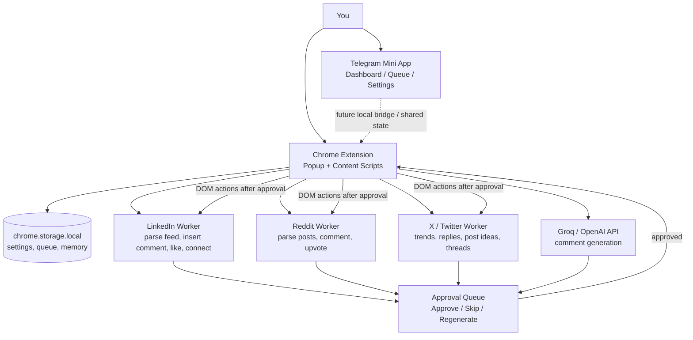

# Engagr

**Engagr is a Telegram Mini App + Telegram Bot that helps founders and growth teams automate LinkedIn and Reddit engagement with AI, safe pacing, and human approval workflows.**

👉 **Use the official bot:** [@Engagr_bot](https://t.me/Engagr_bot)

---

## Repository Description (for GitHub)

Use this as your GitHub repository description:

> AI-powered Telegram Mini App for LinkedIn & Reddit engagement automation with approval queue, warm-up mode, anti-ban limits, and live session logs.

## Suggested GitHub Topics

Add these topics in your repo settings:

- `telegram-bot`
- `telegram-mini-app`
- `linkedin-automation`
- `reddit-bot`
- `ai-comments`
- `playwright`
- `flask`
- `react`
- `growth-automation`
- `social-media-automation`

---

## What Engagr Does

- Generates contextual AI comments for LinkedIn and Reddit.
- Lets you approve, edit, skip, or regenerate comments before posting.
- Runs scheduled engagement sessions with jittered timing and daily limits.
- Supports warm-up mode for safer account ramp-up.
- Shows live session logs so users can see what automation is doing.

---

## Core Features

- 🤖 **AI Comment Generation** with selectable tone/persona.
- 🔗 **LinkedIn Automation** via browser-based workflow and session cookies.
- 🧡 **Reddit Automation** with API-based integration.
- 📱 **Telegram Mini App UI** for onboarding, dashboard, queue, and settings.
- 💬 **Telegram Chat Fallback** for approvals directly in bot chat.
- ⏰ **Smart Scheduling** with per-platform sessions.
- 🛡️ **Anti-ban Controls**: jitter, hard daily caps, and pacing.
- 📊 **Live Session Visibility**: logs + health/status widgets.

---

## Quick Start

### 1) Requirements

- Python 3.11+
- Node.js 18+
- Telegram bot token from [@BotFather](https://t.me/BotFather)

### 2) Install

```bash
git clone https://github.com/Leks2000/Engagr.git
cd Engagr

# Backend
pip install -r requirements.txt

# Frontend
cd frontend
npm install
npm run build
cd ..
```

### 3) Environment

```bash
cp .env.example .env
```

Fill required values:

```env
TELEGRAM_BOT_TOKEN=your_bot_token_here
GROQ_API_KEY=your_groq_api_key
MINI_APP_URL=https://your-frontend-url.com
```

### 4) Run

```bash
python backend/main.py
```

For frontend development:

```bash
cd frontend
npm run dev
```

---

## LinkedIn Setup Notes

- Preferred approach: import valid session cookie (`li_at`) through the app flow.
- If session expires, reconnect account and refresh cookie/session.
- Use moderate limits and warm-up mode for newer accounts.

---

## Project Structure

```text
engagr/
├── backend/
│   ├── main.py
│   ├── config.py
│   ├── storage.py
│   ├── ai_comment.py
│   ├── linkedin.py
│   ├── reddit_bot.py
│   ├── scheduler.py
│   ├── telegram_bot.py
│   └── setup.py
├── frontend/
│   ├── src/
│   │   ├── App.jsx
│   │   ├── screens/
│   │   └── components/
│   ├── index.html
│   └── vite.config.js
├── requirements.txt
├── railway.toml
└── README.md
```

---


## Personal MVP Architecture (Extension-first)

This project is moving toward a **personal, local-first AI Social Copilot MVP**. For the next build stage, the Chrome Extension is the main runtime and the Telegram Mini App is the control surface. Backend, database, Docker, multi-user auth, and multi-account infrastructure are intentionally out of scope until the extension workflow is useful every day.



### MVP 10 Steps

| Step | Status | Goal | Result |
|------|--------|------|--------|
| 1. Extension | ⬜ Planned | Manifest V3, popup UI, settings, `chrome.storage`, connection/status check. | Extension v0.1 loads and shows connected/ready state. |
| 2. LinkedIn Parser | ⬜ Planned | Read LinkedIn feed posts: author, text, URL. | `{ author, post, url }` objects collected from the page. |
| 3. AI Comments | ⬜ Planned | Connect Groq/OpenAI, generate comments, regenerate variants. | Each parsed post can receive an AI comment draft. |
| 4. Mini App | ⬜ Planned | Control center with Dashboard, LinkedIn, Reddit, X, Queue, Ideas, Settings. | A single UI for reviewing work and settings. |
| 5. Approval Queue | ⬜ Planned | Approve, Skip, Regenerate flow before any action. | AI drafts wait for your decision. |
| 6. LinkedIn Actions | ⬜ Planned | Insert comments, like posts, prepare connect messages. | Approve → extension opens LinkedIn → draft is inserted. |
| 7. Reddit | ⬜ Later | Repeat parser, comments, queue, upvote flow for Reddit. | Reddit opportunities enter the same queue. |
| 8. User Memory | ⬜ Later | Store project, audience, goal, tone, interaction history. | More personalized comments and recommendations. |
| 9. Ideas Engine | ⬜ Later | Collect AI/dev/startup news and generate content ideas. | 5 posts, 3 threads, 10 comment ideas. |
| 10. X / Twitter | ⬜ Later | Trends, replies, post ideas, threads. | X becomes a third platform module. |

### MVP to build now

The first usable MVP is only steps **1–6**:

```text
Open Telegram / extension UI
↓
See a LinkedIn post opportunity
↓
AI generates a comment
↓
Approve / Skip / Regenerate
↓
Extension opens LinkedIn
↓
Extension inserts the approved comment draft
↓
You make the final publish decision
```

See [`EXTENSION_GUIDE.md`](EXTENSION_GUIDE.md) for the planned local setup, loading, and Chrome Web Store release checklist.

---

## Semi-Auto Workflow (Queue Card Actions)

Each post in the queue shows:

| Button | Action |
|--------|--------|
| **💬 Copy & Open** | Copies selected AI comment to clipboard → opens LinkedIn post deep link |
| **👍 Like** | Opens post for quick reaction |
| **🤝 Invite** | Generates 300-char invite → copies to clipboard → opens author profile |
| **✏️ Edit** | Modify the AI comment before copying |
| **🔄 Regen** | Generate a new comment variant |
| **✕ Skip** | Remove post from queue |

---

## Daily Limits (Hard Caps)

| Platform | Action     | Max/Day |
|----------|-----------|---------|
| LinkedIn | Comments   | 15      |
| LinkedIn | Likes      | 5       |
| LinkedIn | Connections| 5       |
| Reddit   | Comments   | 15      |
| Reddit   | Upvotes    | 5       |

---

## Anti-spam Delays

| Action             | Delay Range     |
|--------------------|-----------------|
| Between comments   | 5–30 minutes    |
| Between likes      | 2–7 minutes     |
| Between connections| 3–10 minutes    |

---

## Bot Commands

| Command       | Description                |
|---------------|----------------------------|
| `/start`      | Welcome + setup            |
| `/dashboard`  | Today's stats              |
| `/queue`      | Pending comments           |
| `/settings`   | Open Mini App settings     |
| `/digest`     | Get daily top-3 posts      |
| `/connections`| View networking CRM        |
| `/linkedin`   | LinkedIn setup guide       |
| `/reddit`     | Reddit setup guide         |
| `/pause`      | Pause all sessions         |
| `/resume`     | Resume sessions            |

---

## Key Killer Features

### 1. Humanness Scorer
Posts are analyzed for AI-generated patterns (cliches, emoji spam, engagement bait). Only genuinely human posts appear in your queue.

### 2. Interaction Memory (CRM)
The app remembers who you've engaged with before. When the same author posts again, you get a notification: "You've interacted with them 3 times before. Keep building this relationship!"

### 3. News Jacking
First comments under viral posts get 90% of views. The system monitors RSS feeds and alerts you to trending topics matching your keywords.

### 4. Nested Conversation Booster
When someone replies to your AI comment, the app generates a follow-up reply to keep the conversation going and convert leads.

### 5. Daily Digest
Every morning, you receive 3 top posts with ready-made comments in Telegram. One tap to copy + open.

---

## Railway Deployment

1. Push to GitHub
2. Deploy on [railway.app](https://railway.app) → Deploy from GitHub
3. Add environment variables
4. Railway auto-deploys using `railway.toml`

---

## License

MIT
